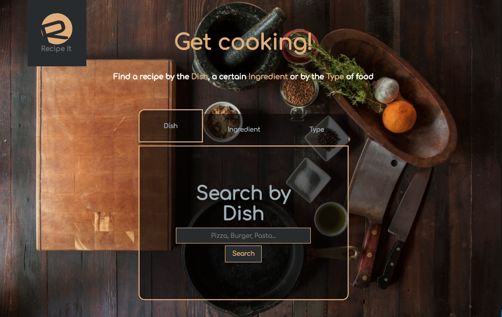
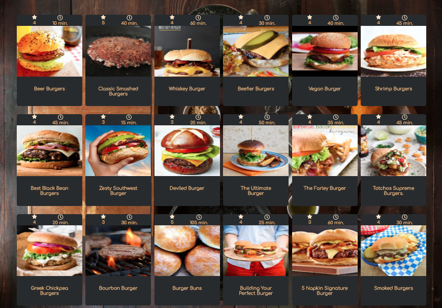
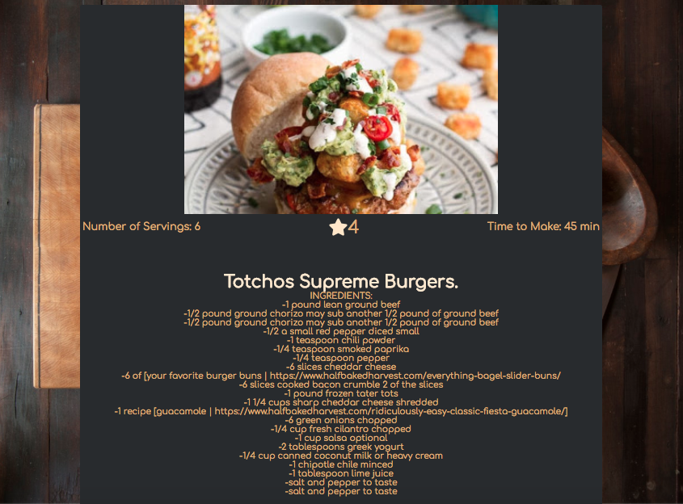

# Recipe It

A quick and easy-to-use app for finding recipes.  

## Live Demo

https://zbrandon86.github.io/finalRecipe/

## Screenshots

### Home Screen:

### Results Page:

### Selected Recipe:

## About Recipe It

With the Recipe It app you can quickly find recipes for breakfast, lunch, dinner or even date night. On the home page you have 3 options to search for a recipe. You can search by dish, by ingredient or by type. Once you search, you will be presented with a page full of recipes with a name, a photo, a rating and how long the recipe takes to make. From here you can click on the recipe you want. You will then be taken to a page with a list of the ingredients and even a source link to the orginal recipe with full details.

## Built With:

* HTML
* CSS
* JavaScript
* jQuery

